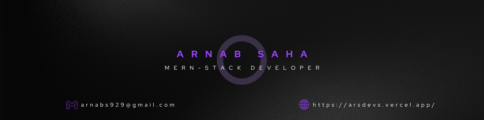

# Hi 👋, I am Arnab. 

Junior MERN stack developer specializing in dynamic web applications with proficiency in React, Express, Node, MongoDB, and Tailwind CSS. Currently advancing skills with Next.js to optimize performance and user experience. Committed to continuous improvement, I strive to create robust, scalable, and high-performance solutions, showcasing a proactive approach to industry trends.

# 🔧 Technologies & Tools

  

<!-- 

 -->

# 🗂️ Recent Projects

### 🚀 Student and Class Management System
Description:
Welcome to Skill Nest, a cutting-edge Student and Class Management System meticulously crafted with the powerful MERN stack. Designed to revolutionize the educational experience, Skill Nest seamlessly integrates user authentication, course creation, and an intuitive dashboard for a holistic

Live Demo: 🔗  [Demo](skill-nest.netlify.app/)

GitHub Repository: 🔗  [Repository](https://github.com/ArnabTo/skill-nest-client)

### 🚀 Share Plate - Connecting Communities Through Food
Description: Welcome to Share Plate, a dynamic Food Sharing Platform developed with the versatile MERN stack. This platform is designed to facilitate the seamless sharing of surplus food within communities.

Live Demo: 🔗  [Demo](arsdev-food-share.netlify.app/)

GitHub Repository: 🔗  [Repository](https://github.com/ArnabTo/share-plate-client)

### 🚀 TechTrend - Technology and Electronics E-commerce Platform
Description: Welcome to TechTrend, your premier destination for cutting-edge technology and electronics! This MERN stack-powered E-commerce platform is designed to provide a seamless and efficient shopping experience.

Live Demo: 🔗  [Demo](arsdev-techtrend.netlify.app/)

GitHub Repository: 🔗  [Repository](https://github.com/ArnabTo/brand-shop-client)

# 📈 Current stats

