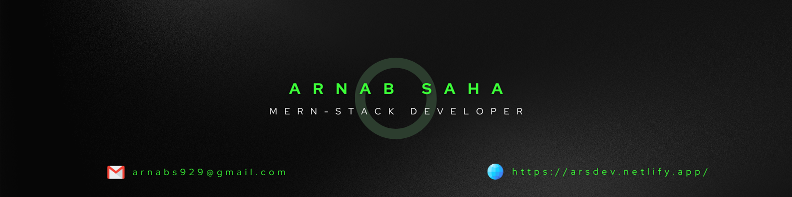

I am a Passionate MERN stack developer

# 🔧 Technologies & Tools

  

## 🗂️ Recent Projects

### Project Name 1
Description:
Welcome to Skill Nest, a cutting-edge Student and Class Management System meticulously crafted with the powerful MERN stack. Designed to revolutionize the educational experience, Skill Nest seamlessly integrates user authentication, course creation, and an intuitive dashboard for a holistic

Live Demo: [Project 1 Demo](skill-nest.netlify.app/)

GitHub Repository: [Project 1 Repository](https://github.com/your-username/project-1)

### Project Name 2
Description: Another exciting project showcasing your skills and creativity.

Live Demo: [Project 2 Demo](https://your-demo-link-2.com)

GitHub Repository: [Project 2 Repository](https://github.com/your-username/project-2)

### Project Name 3
Description: Describe the third project, emphasizing any unique aspects or technologies used.

Live Demo: [Project 3 Demo](https://your-demo-link-3.com)

GitHub Repository: [Project 3 Repository](https://github.com/your-username/project-3)

# 📈 Current stats

